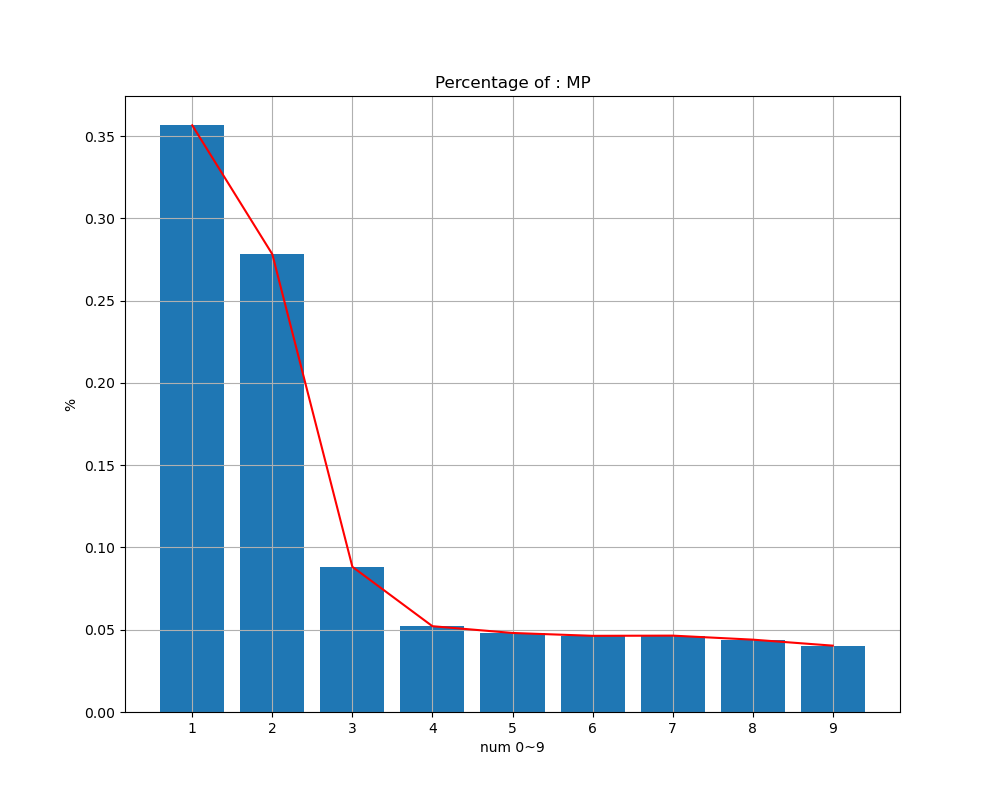
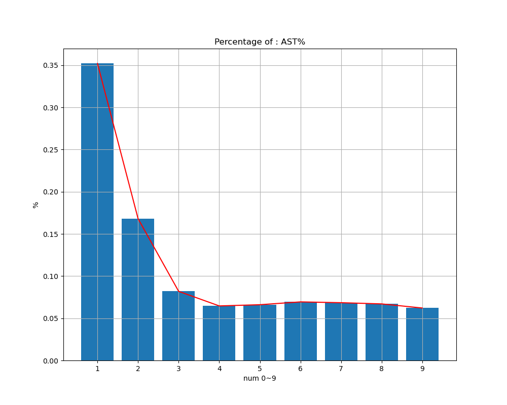
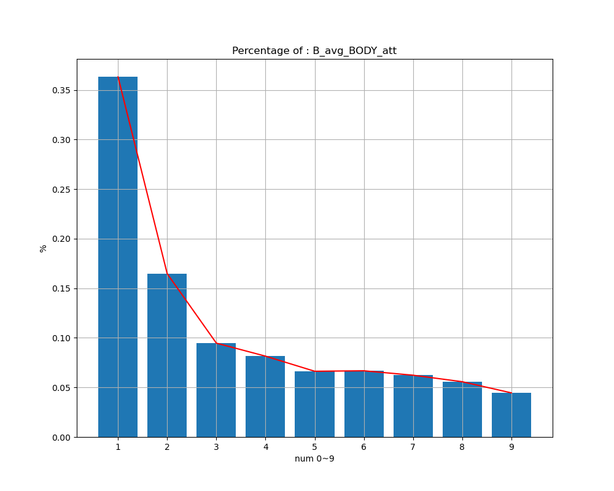
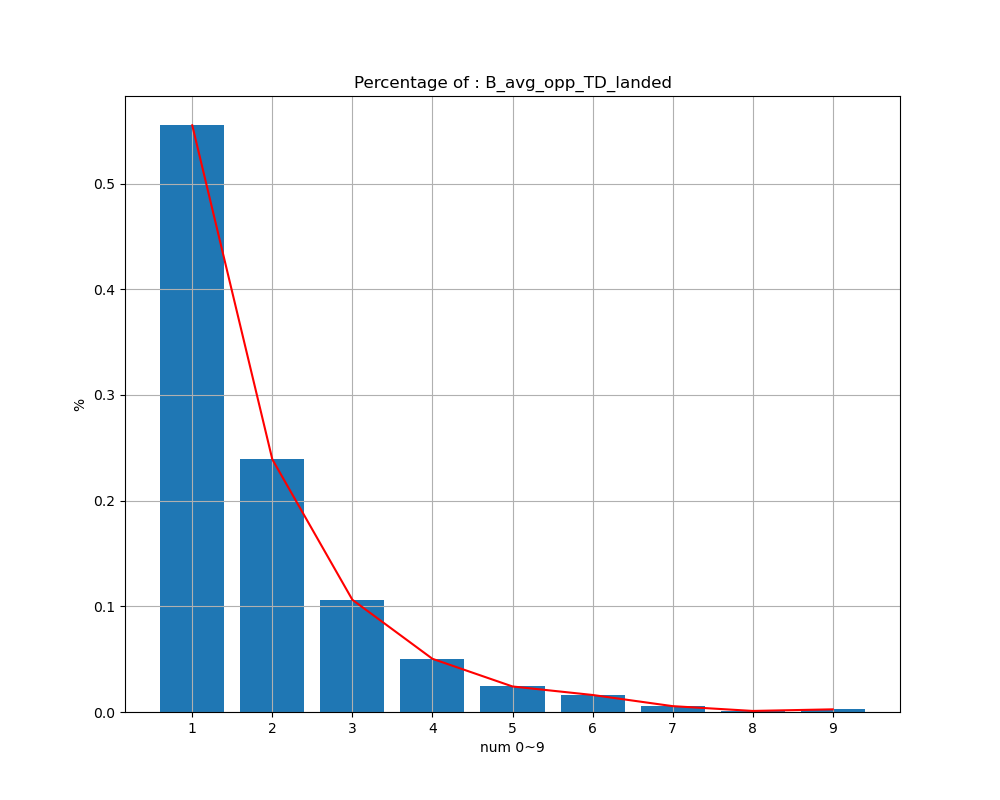
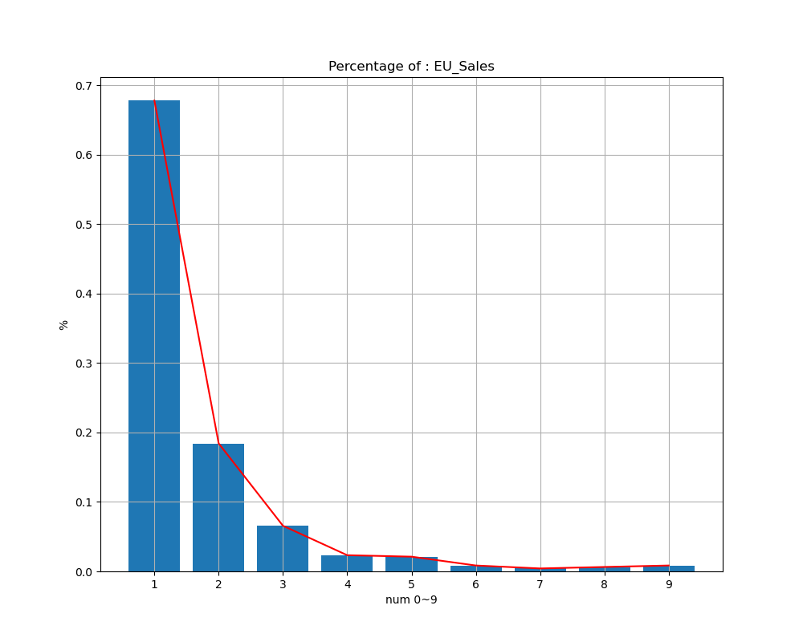

## Project : Benford`s law 

This project was started to prove Benfort's law wrong. I majored in industrial engineering and am used to statistics. In my opinion at first, I think it is right that all numbers should appear with the same probability.

However, as a result of checking various datasets, the Benford law was valid.In most of case, the number 1 appears as the leading significant digit

see more interesting result /result_vis/ufc_stats .. 

## About : Benford's law
[Benford's law wiki](https://en.wikipedia.org/wiki/Benford%27s_law)

Benford's law, also known as the Newcomb–Benford law, the law of anomalous numbers, or the first-digit law, is an observation that in many real-life sets of numerical data, the leading digit is likely to be small.[1] In sets that obey the law, the number 1 appears as the leading significant digit about 30 % of the time, while 9 appears as the leading significant digit less than 5 % of the time. If the digits were distributed uniformly, they would each occur about 11.1 % of the time.[2] Benford's law also makes predictions about the distribution of second digits, third digits, digit combinations, and so on.
...

## result plot 
### NBA Stats
 

### UFC Stats
 

### Market Sales
 

## dataset 
+ [ufc_stats dataset](https://www.kaggle.com/datasets/rajeevw/ufcdata)
+ [market sales dataset](https://www.kaggle.com/datasets/aungpyaeap/supermarket-sales)
+ [nba-stats datasets](https://www.kaggle.com/datasets/drgilermo/nba-players-stats)
